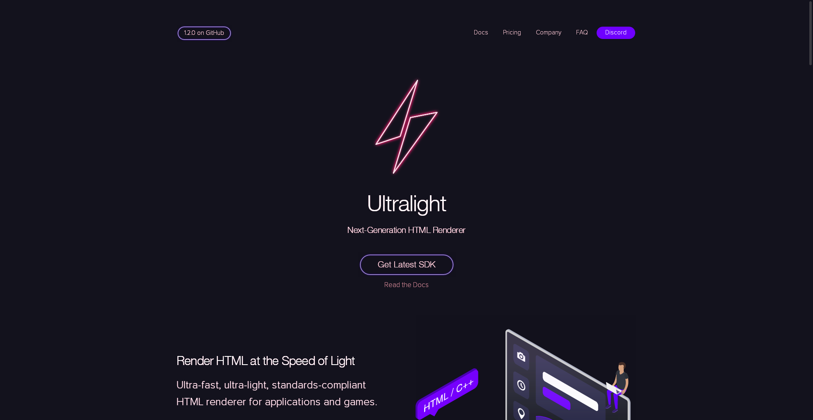

# Getting Started

## Required Nuget packages

* `UltralightNet`
* `UltralightNet.AppCore` (because AppCore provides font loader)

## How to render a static page

1. Set Font Loader (or crash)
2. Create `Renderer`
3. Create `View`
4. Load page
5. Update renderer until page is loaded
6. Render
7. Get View's Surface
8.  Get Surface's Bitmap
9. Swap Red and Blue channels
10. Save to png file

## Code / Ready to run project

[GettingStarted](https://github.com/SupinePandora43/UltralightNet/tree/master/UltralightNet.GettingStarted)

## PNG Result

